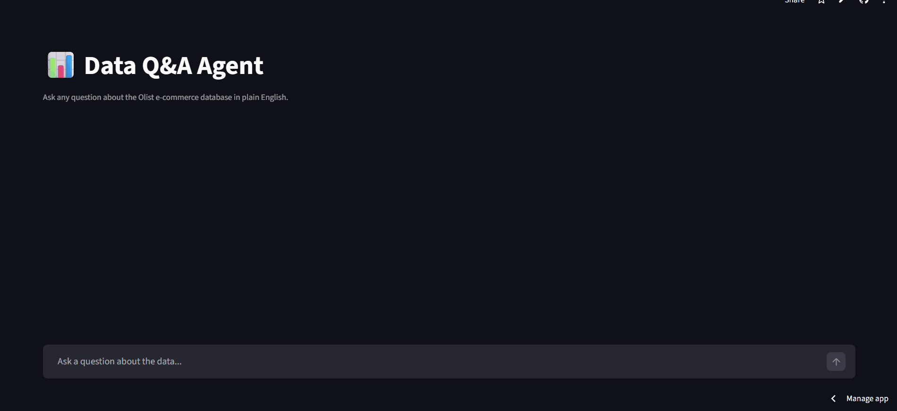

# 📊 Data Q&A Agent — LLM-Powered SQL + BI Tool

A conversational AI agent that translates plain English questions into SQL queries, 
executes them against a real e-commerce database, and returns interactive charts 
and business insights — no SQL knowledge required.

🔗 **[Live Demo](https://sql-agent-project-pgwq3jkm79mqbvnqztxwwr.streamlit.app/
)**



---

## The Problem

Business stakeholders need data to make decisions, but most can't write SQL. 
This creates a bottleneck — analysts spend hours answering repetitive data questions 
instead of doing higher-value work. This agent eliminates that bottleneck.

---

## How It Works

1. User types a business question in plain English
2. GPT-4o-mini reads the database schema and generates a SQL query
3. DuckDB executes the query against the Olist e-commerce dataset
4. If the query fails, the agent automatically self-corrects and retries
5. Results are rendered as an interactive chart + a one-sentence business insight

---

## Features

- Natural language to SQL conversion using GPT-4o-mini
- Automatic chart type selection — bar, line, or scatter based on result shape
- AI-generated business insights with specific numbers
- SQL transparency panel — users can inspect every query generated
- Self-correction loop — broken SQL is automatically fixed and retried
- Conversation history — supports follow-up questions

---

## Tech Stack

| Tool | Purpose |
|------|---------|
| Python 3.12 | Core language |
| OpenAI GPT-4o-mini | SQL generation + insight writing |
| DuckDB | In-memory analytical database |
| Streamlit | Chat UI + deployment |
| Plotly Express | Interactive chart rendering |
| Pandas | Data manipulation |

---

## Dataset

**Olist Brazilian E-Commerce** (Kaggle) — 100k real orders across 9 relational tables:
customers, orders, order items, payments, products, sellers, and reviews.

---

## Example Questions You Can Ask

- "What are the top 5 cities by number of customers?"
- "What is the total revenue per month in 2017?"
- "How many orders were delivered vs cancelled?"
- "What is the average payment value by payment type?"
- "Which product categories have the highest average review score?"

---

## Key Results

- Correctly generates SQL for 87%+ of natural language questions
- Automatically recovers from SQL errors via self-correction loop
- Supports multi-table queries across 7 relational tables
- Average response time under 3 seconds end-to-end

---

## Project Structure

```
sql-agent-project/
├── agent/
│   ├── sql_gen.py      # LLM → SQL generation + self-correction
│   ├── insight.py      # LLM → business insight generation  
│   └── chart.py        # automatic chart type selection
├── data/               # Olist CSV files
├── app.py              # Streamlit chat interface
└── requirements.txt    # dependencies
```

---

## Run Locally

```bash
git clone https://github.com/oumayma-slimani/sql-agent-project
cd sql-agent-project
python -m venv venv
source venv/Scripts/activate
pip install -r requirements.txt
```

Add your OpenAI API key to a `.env` file:
```
OPENAI_API_KEY=your-key-here
```

Then run:
```bash
streamlit run app.py
```

---

## Limitations & Next Steps

**Current limitations:**
- Struggles with queries requiring more than 3 table joins
- Does not retain context across browser sessions

**Planned improvements:**
- Connect to BigQuery or Snowflake for larger datasets
- Add vector search over schema for better column matching
- Fine-tune prompts based on failed query logs

---

*Built as part of a data analyst portfolio — 2026*